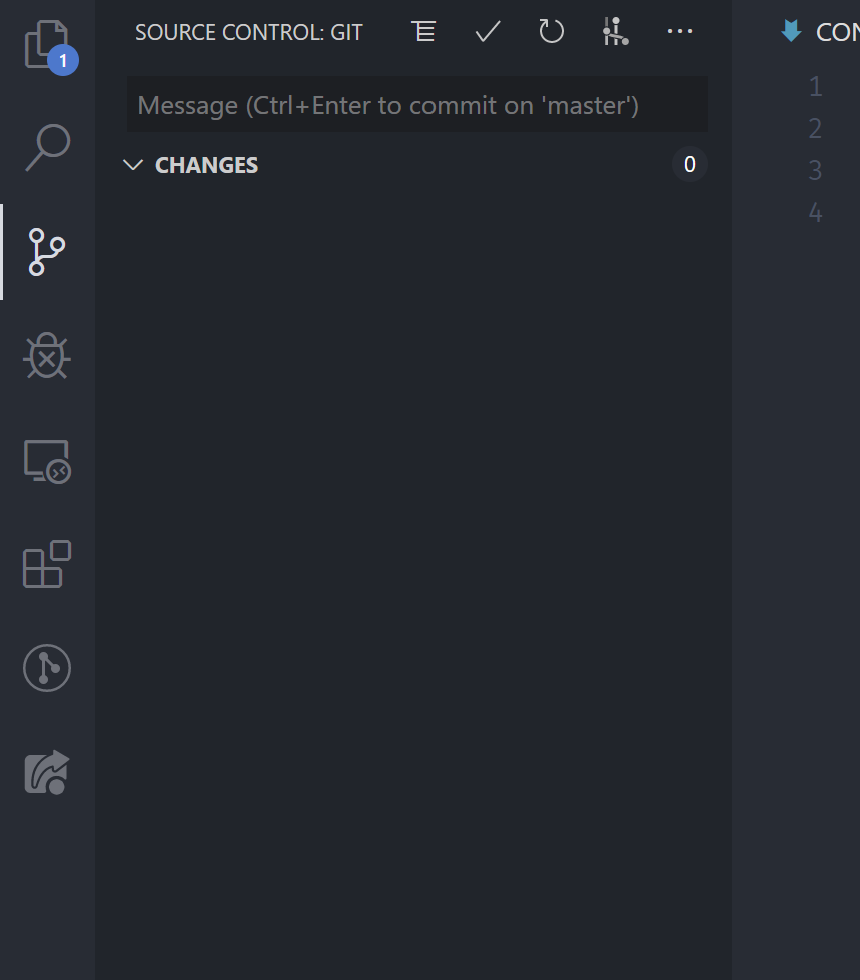
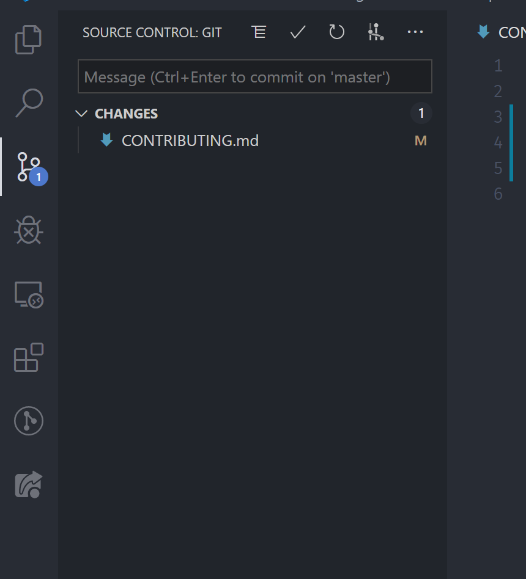
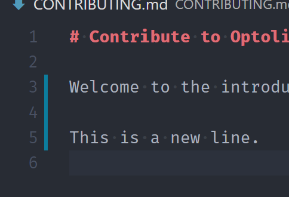
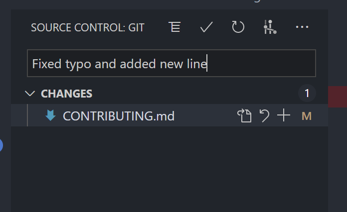
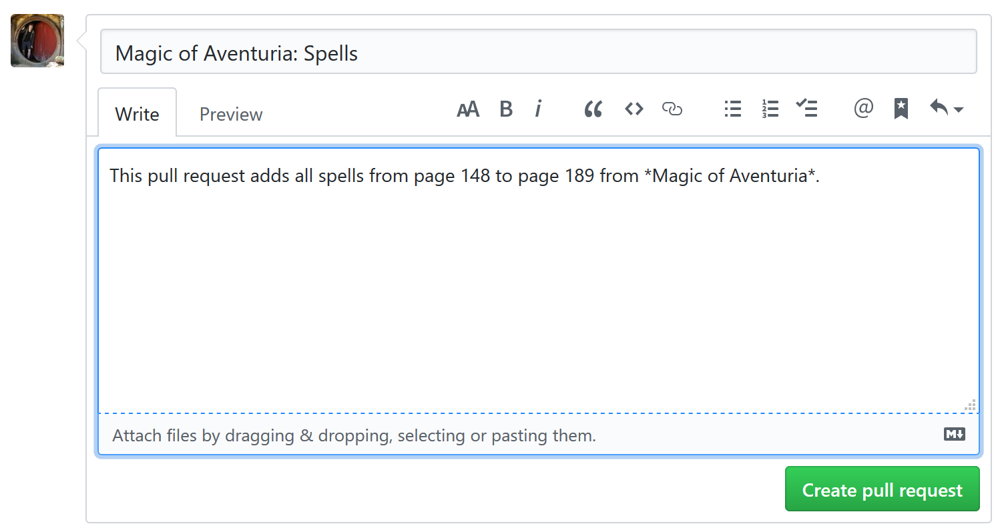

# Git Workflow

Welcome to the introduction on how to contribute to Optolith static data using Git!

You'll need a [GitHub account](https://github.com) (which you probably have if you see this), [Git](https://git-scm.com/downloads) locally installed and a code editor. I'll explain the steps you need to take using [Visual Studio Code](https://code.visualstudio.com) (VSCode), because it's a very easy-to-use and lightweight editor. I will try to avoid the command line in this tutorial.

This tutorial is intended for helpers who have not yet learned about Git and programming. If you are already familiar with both, just jump to a later point or skip the tutorial altogether!

## Getting started

Create a new GitHub account, if don't own one already.

Install *Git*. You don't need to change any installation options, just click *Next*.

Let's *clone* the *repository* onto your computer.

A *respository* &ndash; or simply *repo* &ndash; is kind of a special folder with explicit version control. The source repo is online on GitHub.com &ndash; which is where you are probably reading this tutorial right now &ndash; but you can create copies of it on other computers so that you can work on them like in normal folders and files.

Now you can create a local copy of the repo by using a command in the command line &ndash; this is the only time you need to do this!

### On Windows:
Open the Windows explorer and go to a folder where you would like to out the copy. Open the context menu in the folder while pressing `Shift` and select *Open PowerShell here* from the list.


Then run

```shell script
git clone https://github.com/elyukai/optolith-data.git
```

This will create a new folder named `optolith-data`, which contains the repo.

If you want to give the folder a new name, instead use

```shell script
git clone https://github.com/elyukai/optolith-data.git folder
```

`folder` is the new folder's name.

If you want to copy the repo into the current folder without an extra subdirectory, instead use

```shell script
git clone https://github.com/elyukai/optolith-data.git .
```

**Warning:** Don't put this folder inside a folder synced to a cloud service, since a lot of tiny files will not work with it and may crash your service.

### On Mac:
Open the finder and go *to the parent folder* of a folder where you would like to out the copy. Open the terminal, type `cd` and then drag the folder you want the repo in into the terminal. This will insert the path to the folder. It should roughly look like

```shell script
cd ~/path/to/folder
```

The space between `cd` and the folder path is important!

Then run

```shell script
git clone https://github.com/elyukai/optolith-data.git
```

This will create a new folder named `optolith-data`, which contains the repo.

If you want to give the folder a new name, instead use

```shell script
git clone https://github.com/elyukai/optolith-data.git folder
```

`folder` is the new folder's name.

If you want to copy the repo into the current folder without an extra subdirectory, instead use

```shell script
git clone https://github.com/elyukai/optolith-data.git .
```

## Install and configure VSCode

Follow the [Setting Up an Editor guide](./Setting-Up-an-Editor).

## Begin your Work

To start working on a new feature you need to create a new *branch*.

*Branches* are a core feature of Git. A branch represents a special development status or direction. Branches build up on each other. You can branch off from an existing branch, but you can also merge a branch into another branch. The default branch is called `develop` &ndash; usually it is called `master` but the `master` branch in this repo has a different meaning. The `develop` branch is where all contributions are merged and it is also directly reflected in the newest prereleases of Optolith.

To start contributing to a specific area and thus to create a new branch, you need to click on the active branch you are currently on in the status bar of VSCode. Make sure you are currently on the `develop` branch.


This opens a list of available branches. You can switch to an existing branch or create a new branch (online branches have the `origin/` prefix, they will be downloaded if you select them).


We're gonna create a new branch via `Create new branch...`. The name of the branch depends on what you want to do:

- If you want to fix an issues, prefix the branch name with `fix/`, e.g. `fix/moa3-source-refs`.
- If you want to add a new feature, e.g. add a section of a new book, prefix the branch name with `feature/`, e.g. `feature/moa3-spells`

Type it into the next input field and hit enter.


Now the active branch in the status bar should be what you just typed in. You created your first branch! Next to the branch name will be the symbol for an unpublished branch. You can click it an then it will be uploaded to GitHub.

**Note:** You can and should create multiple branches if you are working on multiple areas at once. You can always switch between them. They are independent from each other.

Now you can start editing the files. Even though this is called *repo* just use it as a normal file system! There are just some advantages over a default file system &ndash; because you can save versions!

## Check out your current work

You can see all changes made in the Git tab.



In the beginning, this tab will not list any changes &ndash; because you haven't done anything yet!

Once you change something (and save it) it will be shown here.



While you edit you can see which lines are edited on the left side.



You can also do a detailed comparison between the old version of the file and the one you edited if you click on a file in the Git tab.


Once you think you came to a point where it would make sense to create a new version of a file &ndash; it can be you entered the first 20 entries of the section you want to add or you've finished for the day &ndash; you can create a new *commit*.

A *commit* represents a new point in history for the repository. It contains all changes made since the last point. (You can also select which files to commit but I will not cover that here.) Commits are the actual *versions* in Git.

To create a new commit, you go to the Git tab an insert a *commit message*. It can also span multiple lines. Please do always write meaningful commit messages so that everyone knows roughly what you did without checking out the actual file edits. You don't need write a lot, though. If there's anyone interested in the detailed changes, it's often easier to just checkout your changes &ndash; but a short commit message can make that way easier to understand.



Now type `Ctrl+Enter` on Windows or `Cmd+Enter` on Mac or click on the checkmark above the commit message. VSCode will probably ask you if you want to commit unstaged changes because there are no staged changes. Yes, you want that.

Now your list of changes will be clean. Instead, next to the active branch in the status bar there will be a counter indicating that there is one commit to *push* and no commit to *pull*.


With *push* and *pull* you can *push* new commits from your local repo to the online repo or you can *pull* new commits from the online repo into your local repo.

Both operations does VSCode automatically if you click on the counter (the sync functionality is also available without the counter; sometimes VSCode does not update the counter so you have to click on the sync icon).

Now your commit is online. Let's check it out.

## Working with GitHub

In the *Code* tab on the repo's page is an option to switch branches. Clicking on that will show a list of all branches that are available online. At the time of writing there are exactly two branches &ndash; the `master` and my own `test` branch.


Switch to your branch. It will now suggest to create a pull request.


### Create a Pull Request (PR)

A *Pull Request* (PR) is a request to merge the new commits from a certain branch into another branch &ndash; which is what you want: You want to merge your changes into the main development branch.

Click on *Compare & pull request*.

On the next page you can configure your PR. You can see the *base branch* and the *compare branch*. The *compare branch* will me merged into the *base branch*. So the *base branch* should always be `develop` and the *compare branch* should be your own branch.


Then you can insert a title for what you're working on and describe it. Keep the title short and write more explanation into the comment section.


Example:



You'll get notified per e-mail if there are any comments and once you're done and your changes are approved, I will merge your PR. You don't need to do anything else then.

*Please note that pull requests update if you push more commits to GitHub, so please don't close your already created pull requests. This way we can keep track of the changes and discuss them!*

## Continue your work

To start on a new feature, create a new branch as explained before. But you need to make sure that you branch off from `develop` and that there are no commits to pull! If you switch to `develop` and the sync indicator says there are one or more changes to pull (incoming changes) you need to sync first! Only then you should create a new branch.
