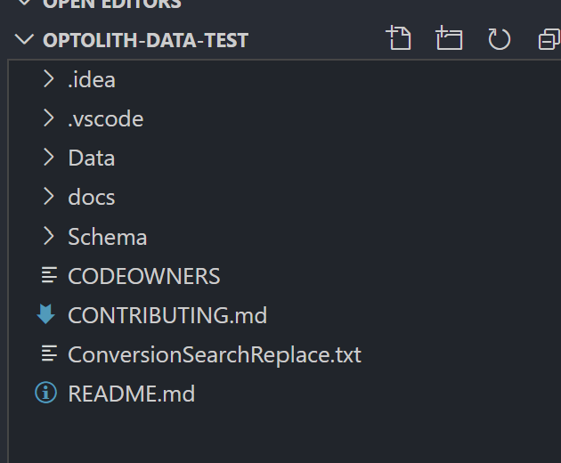
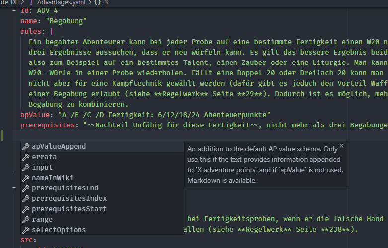

# Setting Up an Editor

Editing the YAML files with a proper editor will make it much easier to work with. You don't need any coding knowledge or editor knowledge, but it will help you a lot.

I recommend [Visual Studio Code](https://code.visualstudio.com) (VSCode), since it's lightweight and very easy to use. I will use it for all tutorials here. Bonus: I also use it to work on Optolith, so the configuration you need is already present.

## 1. Install an editor

Install *Visual Studio Code* from the page linked above. (or another editor of your choice). I'd recommend to check *Add "Open with Code" to file context menu* and *Add "Open with Code" to directory context menu*.

## 2. Open the Project

*This step assumes you either cloned the repo by following the [Git Workflow](./Git-Workflow) or got the project folder from me.*

If you checked the context menu additions during the installation process, you can open the context menu of the project folder and select *Open with Code*. Otherwise you can open VSCode and select the repo folder via `File > Open Folder...`. *It is important to open the project folder!*

This should be the initial folder structure you can check out. `Data` contains all data, while `Schema` contains the schemes for the data files.

## 3. Activate Schema validation

*Schemes* validate files and the editor can highlight errors so you can easily fix them. To get schema validation in VSCode, you need to install the YAML extension from RedHat.

The configuration for the VSCode YAML extension is already present, so you don't need to configure the schemes yourself.

## 4. Done!

Now you should see explanations of fields if you hover over them:

You'll also get autocompletion if you start typing or press `Ctrl+Space` (Windows, Linux) or `Cmd+Space` (macOS):

